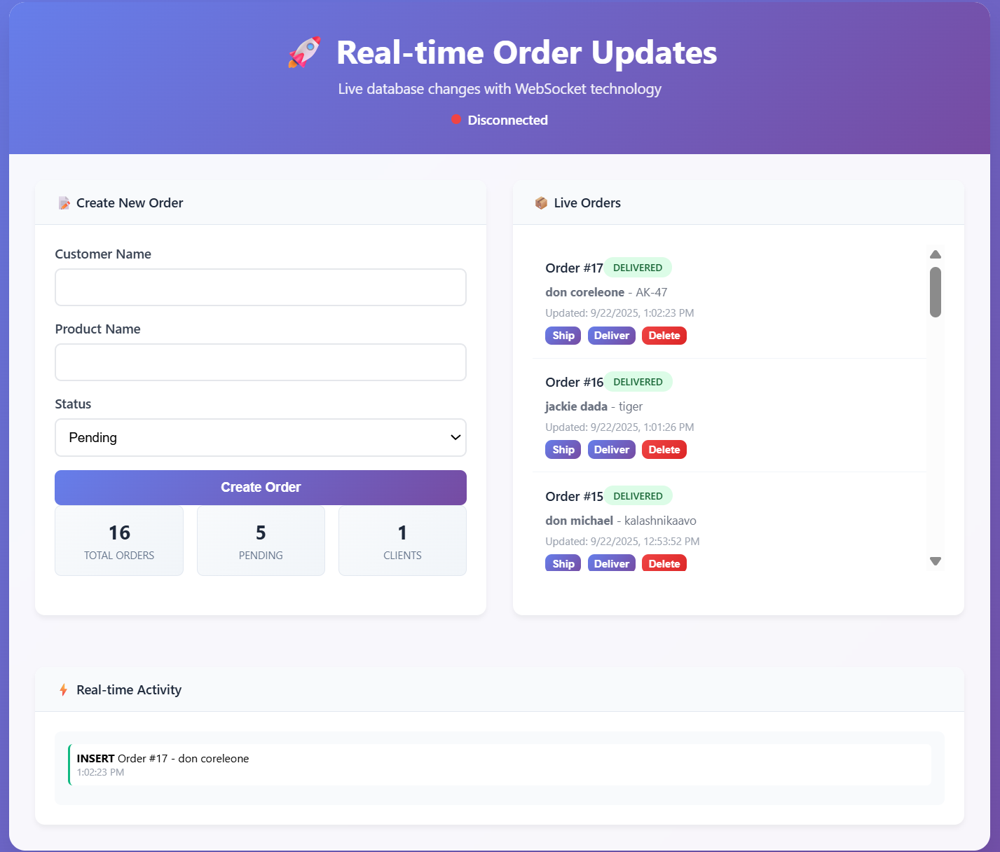

# 🚀 Real-time Database Updates System

A production-ready real-time system that automatically pushes database changes to connected clients using WebSockets, without polling. Built with Node.js, PostgreSQL, and Socket.io.



## ✨ Features

- 🔄 **Real-time Updates**: Instant notifications on INSERT, UPDATE, DELETE operations
- ⚡ **No Polling**: Event-driven architecture using PostgreSQL NOTIFY/LISTEN
- 🔌 **Multiple Clients**: Web interface, CLI client, and automated testing
- 🔒 **Secure**: Input validation, rate limiting, and CORS protection
- 📈 **Scalable**: Handles thousands of concurrent WebSocket connections
- 🛠️ **Easy Setup**: One-command deployment with detailed documentation

## 🏗️ System Architecture

```
┌─────────────┐    ┌──────────────┐    ┌─────────────┐    ┌─────────────┐
│  PostgreSQL │───▶│   Triggers   │───▶│   Node.js   │───▶│   Clients   │
│  Database   │    │   NOTIFY/    │    │   Backend   │    │ (WebSocket) │
│             │    │   LISTEN     │    │  (Socket.io)│    │             │
└─────────────┘    └──────────────┘    └─────────────┘    └─────────────┘
```

### How It Works

1. **Database Triggers**: Automatically detect any changes to the `orders` table
2. **PostgreSQL NOTIFY**: Triggers emit structured notifications with change details
3. **Node.js LISTEN**: Backend service receives notifications in real-time
4. **WebSocket Broadcast**: All connected clients receive updates instantly

## 📋 Table of Contents

- [Quick Start](#-quick-start)
- [Prerequisites](#-prerequisites)
- [Installation](#-installation)
- [Database Setup](#-database-setup)
- [Configuration](#-configuration)
- [Usage](#-usage)
- [API Documentation](#-api-documentation)
- [Client Applications](#-client-applications)
- [Testing](#-testing)
- [Contributing](#-contributing)

## 🚀 Quick Start

```bash
# 1. Clone and setup
git clone <https://github.com/SahilSuman1011/real-time-Order-Updates.git>
cd realtime-db-updates
npm install

# 2. Setup PostgreSQL database
# Follow the database setup guide below

# 3. Configure environment
cp .env.example .env
# Edit .env with your database credentials

# 4. Start the server
npm run dev

# 5. Open applications
# Web client: http://localhost:3001
# CLI client: node clients/cli-client.js
# Run tests: node clients/test-client.js
```

## 📋 Prerequisites

- **Node.js** v16 or higher ([Download](https://nodejs.org/))
- **PostgreSQL** v12 or higher ([Download](https://postgresql.org/download/))
- **pgAdmin 4** (recommended for database management)
- **Git** for version control

## 📦 Installation

### 1. Clone Repository

```bash
git clone <your-repository-url>
cd realtime-db-updates
```

### 2. Install Dependencies

```bash
# Install production dependencies
npm install

# Install development dependencies (optional)
npm install --save-dev nodemon
```

### 3. Project Structure

### 3. Project Structure

```
realtime-db-updates/
├── src/                     # Source code directory
│   ├── config/             # Configuration files
│   │   └── database.js     # Database connection settings
│   ├── services/           # Business logic layer
│   │   ├── dbListener.js   # PostgreSQL NOTIFY/LISTEN handler
│   │   └── websocket.js    # WebSocket event handlers
│   ├── controllers/        # Request handlers
│   │   └── orders.js      # Order operations logic
│   ├── routes/            # API routes
│   │   └── orders.js      # Order endpoints
│   └── server.js          # Main application entry
├── database/              # Database related files
│   └── schema.sql        # Table definitions and triggers
├── clients/              # Client applications
│   ├── cli-client.js     # Command line interface
│   └── test-client.js    # Automated testing client
├── public/               # Static web assets
│   └── index.html       # Web interface
├── package.json         # Project dependencies
├── .env                # Environment variables
├── .env.example        # Environment template
└── README.md          # Project documentation
```

## 🗄️ Database Setup

### Option 1: Using pgAdmin 4 (Recommended)

1. **Open pgAdmin 4** in your browser

2. **Create Database**:
   - Right-click "Databases" → "Create" → "Database..."
   - Name: `realtime_orders`
   - Click "Save"

3. **Create User**:
   - Right-click "Login/Group Roles" → "Create" → "Login/Group Role..."
   - Name: `realtime_user`
   - Password: `your_secure_password`
   - Enable "Can login?" in Privileges tab
   - Click "Save"

4. **Grant Permissions**:
   - Right-click `realtime_orders` database → "Properties"
   - Security tab → Add `realtime_user` with ALL privileges

5. **Run Schema**:
   - Right-click `realtime_orders` → "Query Tool"
   - Copy and paste the contents of `database/schema.sql`
   - Click Execute (▶️)

### Option 2: Using Command Line

```bash
# Connect to PostgreSQL
psql -U postgres

# Create database and user
CREATE DATABASE realtime_orders;
CREATE USER realtime_user WITH ENCRYPTED PASSWORD 'your_secure_password';
GRANT ALL PRIVILEGES ON DATABASE realtime_orders TO realtime_user;
\q

# Run schema
psql -U realtime_user -d realtime_orders -f database/schema.sql
```

### Verify Database Setup

```sql
-- Check tables
SELECT table_name FROM information_schema.tables 
WHERE table_schema = 'public';

-- Check sample data
SELECT * FROM orders;

-- Test notification system
SELECT pg_notify('orders_change', '{"test": true}');
```

## ⚙️ Configuration

### Environment Variables

Create a `.env` file in the project root:

```env
# Database Configuration
DB_HOST=localhost
DB_PORT=5432
DB_NAME=realtime_orders
DB_USER=realtime_user
DB_PASSWORD=your_secure_password

# Server Configuration
PORT=3001
NODE_ENV=development

# Optional: Redis for scaling (uncomment if using)
# REDIS_URL=redis://localhost:6379
```

### Configuration Options

| Variable | Description | Default | Required |
|----------|-------------|---------|----------|
| `DB_HOST` | PostgreSQL host | localhost | Yes |
| `DB_PORT` | PostgreSQL port | 5432 | Yes |
| `DB_NAME` | Database name | realtime_orders | Yes |
| `DB_USER` | Database username | - | Yes |
| `DB_PASSWORD` | Database password | - | Yes |
| `PORT` | Server port | 3001 | No |
| `NODE_ENV` | Environment | development | No |

## 🎮 Usage

### Starting the Server

```bash
# Production mode
npm start

# Development mode (auto-restart on changes)
npm run dev

# With debug logging
DEBUG=* npm start
```

### Accessing Applications

- **Web Interface**: http://localhost:3001
- **API Endpoints**: http://localhost:3001/api
- **Health Check**: http://localhost:3001/health

### Creating Orders

**Web Interface**:
1. Open http://localhost:3001
2. Fill in the form and click "Create Order"
3. Watch real-time updates across all connected clients

**API (cURL)**:
```bash
curl -X POST http://localhost:3001/api/orders \
  -H "Content-Type: application/json" \
  -d '{
    "customer_name": "John Doe",
    "product_name": "Laptop Pro",
    "status": "pending"
  }'
```

**CLI Client**:
```bash
node clients/cli-client.js
# Then type: create
```

## 📡 API Documentation

### Base URL
```
http://localhost:3001/api
```

### Endpoints

#### GET /orders
Get all orders with optional filtering.

**Query Parameters:**
- `status` - Filter by status (pending/shipped/delivered)
- `limit` - Number of results (default: 50)
- `offset` - Pagination offset (default: 0)
- `customer_name` - Filter by customer name (partial match)

**Example:**
```bash
curl "http://localhost:3001/api/orders?status=pending&limit=10"
```

**Response:**
```json
{
  "success": true,
  "data": [
    {
      "id": 1,
      "customer_name": "John Doe",
      "product_name": "Laptop Pro",
      "status": "pending",
      "updated_at": "2024-01-15T10:30:00.000Z"
    }
  ],
  "count": 1,
  "pagination": {
    "limit": 10,
    "offset": 0
  }
}
```

#### POST /orders
Create a new order.

**Body:**
```json
{
  "customer_name": "John Doe",
  "product_name": "Laptop Pro",
  "status": "pending"
}
```

**Response:**
```json
{
  "success": true,
  "data": {
    "id": 1,
    "customer_name": "John Doe",
    "product_name": "Laptop Pro",
    "status": "pending",
    "updated_at": "2024-01-15T10:30:00.000Z"
  },
  "message": "Order created successfully"
}
```

#### GET /orders/:id
Get a specific order by ID.

#### PUT /orders/:id
Update an existing order.

**Body:**
```json
{
  "status": "shipped"
}
```

#### DELETE /orders/:id
Delete an order.

#### GET /orders/stats
Get order statistics.

**Response:**
```json
{
  "success": true,
  "data": {
    "total_orders": 10,
    "pending_orders": 3,
    "shipped_orders": 4,
    "delivered_orders": 3,
    "unique_customers": 8,
    "last_updated": "2024-01-15T10:30:00.000Z"
  }
}
```

#### PATCH /orders/bulk-status
Bulk update order statuses.

**Body:**
```json
{
  "order_ids": [1, 2, 3],
  "status": "shipped"
}
```

### WebSocket Events

#### Client → Server

| Event | Description | Payload |
|-------|-------------|---------|
| `subscribe` | Subscribe to specific updates | `{orderIds: [1,2,3], statuses: ["pending"]}` |
| `unsubscribe` | Unsubscribe from updates | `{orderIds: [1,2,3]}` |
| `ping` | Connection health check | `timestamp` |

#### Server → Client

| Event | Description | Payload |
|-------|-------------|---------|
| `welcome` | Connection established | `{message, clientId, totalClients}` |
| `orders:insert` | New order created | `{type, operation, data, timestamp}` |
| `orders:update` | Order updated | `{type, operation, data, timestamp}` |
| `orders:delete` | Order deleted | `{type, operation, data, timestamp}` |

## 💻 Client Applications

### Web Interface

Modern, responsive web interface with real-time updates.

**Features:**
- Create/update/delete orders
- Live order list with real-time updates
- Activity log showing all changes
- Order statistics dashboard
- Connection status indicator

### CLI Client

Interactive command-line client for terminal users.

```bash
node clients/cli-client.js
```

**Commands:**
- `help` - Show available commands
- `orders` - List all orders
- `create` - Create new order interactively
- `random` - Create random test order
- `status` - Show connection status
- `quit` - Exit application

### Test Client

Automated test suite for system validation.

```bash
node clients/test-client.js
```

**Tests:**
- WebSocket connection
- Database operations (CRUD)
- Real-time event delivery
- Error handling
- Performance metrics

## 🧪 Testing

### Running Tests

```bash
# Run full test suite
node clients/test-client.js

# Manual testing with CLI
node clients/cli-client.js

# API testing with curl
curl -X POST http://localhost:3001/api/orders \
  -H "Content-Type: application/json" \
  -d '{"customer_name": "Test", "product_name": "Test"}'
```

### Test Scenarios

1. **Connection Testing**:
   - WebSocket connection establishment
   - Automatic reconnection on failure
   - Multiple concurrent clients

2. **Database Operations**:
   - Create, read, update, delete orders
   - Data validation and constraints
   - Transaction integrity

3. **Real-time Updates**:
   - Event delivery to all clients
   - Event ordering and consistency
   - Performance under load

4. **Error Handling**:
   - Invalid input handling
   - Database connection failures
   - WebSocket disconnections

## 🤝 Contributing

### Development Setup

```bash
# Clone repository
git clone <repository-url>
cd realtime-db-updates

# Install dependencies
npm install

# Start development server
npm run dev

# Run tests
npm test
```

### Code Style

- **ESLint**: JavaScript linting
- **Prettier**: Code formatting
- **JSDoc**: Documentation comments

### Pull Request Process

1. Fork the repository
2. Create a feature branch
3. Make your changes
4. Add/update tests
5. Update documentation
6. Submit pull request

### Reporting Issues

Please include:
- Node.js version
- PostgreSQL version
- Operating system
- Error messages
- Steps to reproduce

## 📄 License

This project is licensed under the MIT License - see the [LICENSE](LICENSE) file for details.

## 🙏 Acknowledgments

- **PostgreSQL** for robust NOTIFY/LISTEN functionality
- **Socket.io** for reliable WebSocket implementation
- **Express.js** for the web framework
- **Node.js** community for excellent ecosystem

## 📚 Additional Resources

- [PostgreSQL NOTIFY/LISTEN Documentation](https://www.postgresql.org/docs/current/sql-notify.html)
- [Socket.io Documentation](https://socket.io/docs/)
- [Node.js Best Practices](https://github.com/goldbergyoni/nodebestpractices)
- [Real-time Systems Design Patterns](https://martinfowler.com/articles/201701-event-driven.html)

## 📞 Support

For support and questions:

- **Documentation**: Check this README and inline code comments
- **Issues**: Create a GitHub issue with detailed information
- **Discussions**: Use GitHub Discussions for questions and ideas

---

**Made with ❤️ by [Sahil Suman]**

*Building real-time systems that scale and perform.*